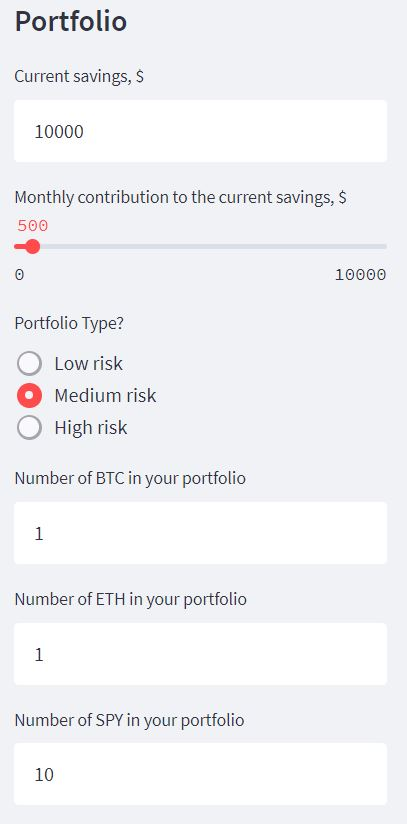
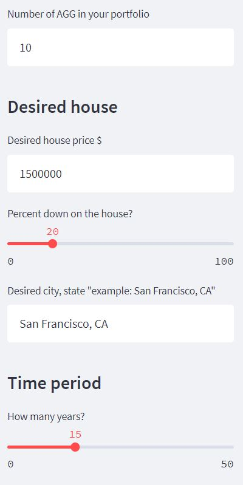
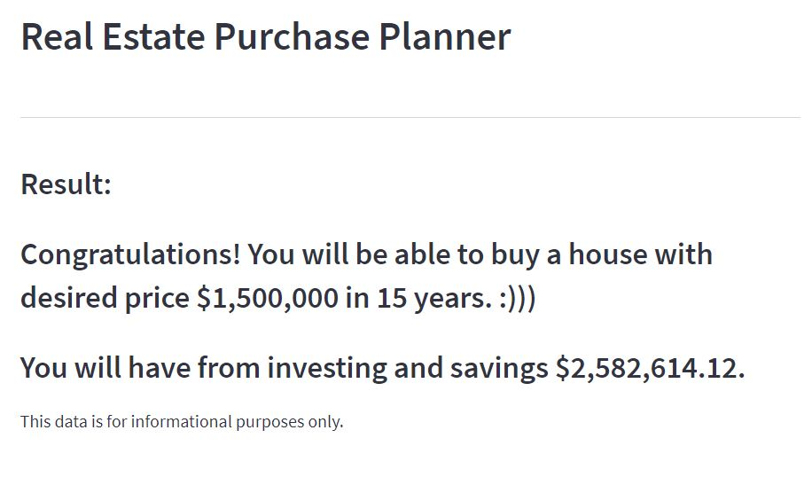
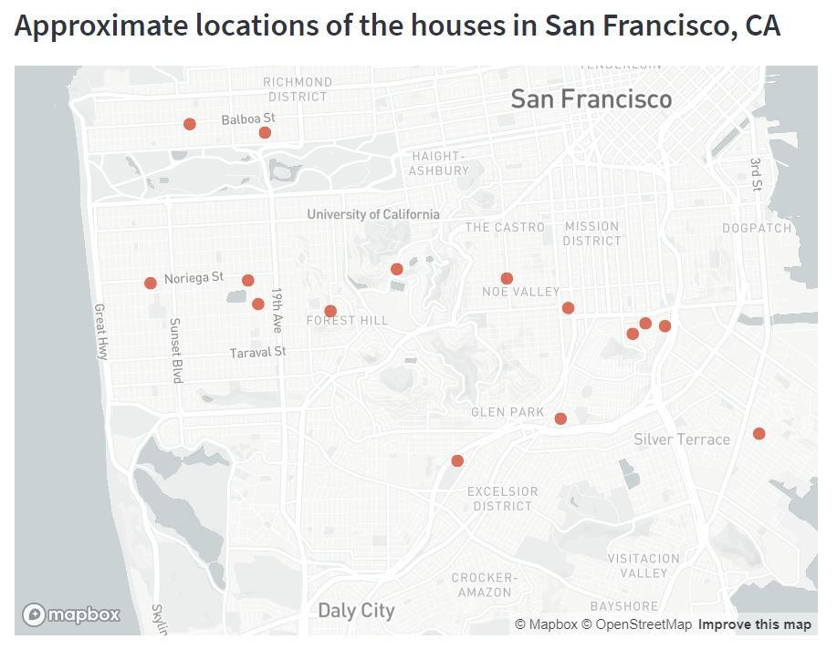
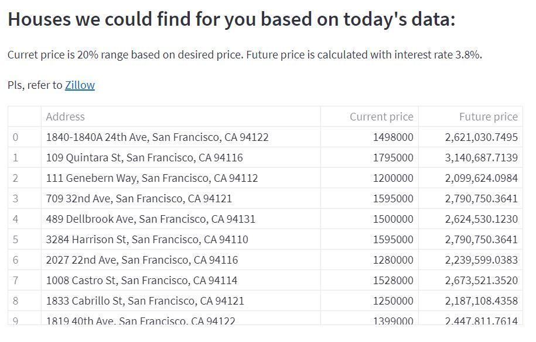

# Real Estate Purchase Planner for California


## Description

The aim of the project is to forecast clients’ portfolios to determine when they can afford real estate at their desired price. Based on user input, the app examines the client's portfolios (i.e., savings, cryptocurrency, stocks) and lendable factors (down payment).
The app utilizes the Monte Carlo simulation to project clients’ portfolios, and it uses the future value equation to project the real estate market. These analyses will allow the application to tell the client in how many years they can afford a house at their desired price.

---

## Technologies

This project uses the standard Python 3.8 libraries and requires the following libraries and dependencies:

```
os
pandas
requests
streamlit
dotenv
alpaca_trade_api
datetime
dateutil.relativedelta
PIL
Monte Carlo simulation script (from MCForecastTools import MCSimulation)
```

The app utilizes APIs:

1. [Alpaca API](https://alpaca.markets) - for pulling stocks, bonds and crypto historical prices
2. [Alternative](https://alternative.me/crypto/api/) - for pulling real time crypto prices
3. [Rapid API - Zillow](https://rapidapi.com/apimaker/api/zillow-com1/) - for houses data

---

## Installation Guide

Before running the application, first install the following dependencies:

- running locally:

```
- git pull the project
- pip install streamlit
- streamlit run app.py (command for running app. Run it from the app folder.)
```

- running in cloud:

```
all needed dependencies are provided in the "environment.yml"
```

As a main part, please, provide secret keys in env file:

```
ALPACA_API_KEY = "YOUR_KEY"
ALPACA_SECRET_KEY = "YOUR_KEY"
RAPIDAPI_KEY = "YOUR_KEY"
```

## Usage

1. To determine how many years it will take to afford the down payment on your desired house price, click on this link:
   [Real Estate Purchase Planner](https://share.streamlit.io/vladislavglupak/real-estate-purchase-planner/main/app.py)

2. Read the questions in the side bar and enter your information.

3. Review the results. You can toggle the risk level to see if a higher risk level allows you to afford the down payment on the house sooner.

## Methods

Monte Carlo simulation is used to predict approximate earnings from investments and savings. To see how this method works, please see the "MCForecastTools.py" script.

## How it works

1. The user answer on the questions in the sidebar of app:





2. After that, the user have to wait when calculation is done


3. As a results of calculation, the user will see message with congratulations or sorry message.



4. As additional information, the user will see the current houses offers in the desired city

On the map:



And table:



---

## Contributers

Vladislav Glupak - [GitHub](https://github.com/VladislavGlupak)

Catherine Croft - [GitHub](https://github.com/ccroft6)

Amanda Hum - [GitHub](https://github.com/amandahum18)

Magdalena Švimberská - [GitHub](https://github.com/MagdaSvim)

Thomas Brierton - [GitHub](https://github.com/ThomasBrierton)

---

## License

MIT
